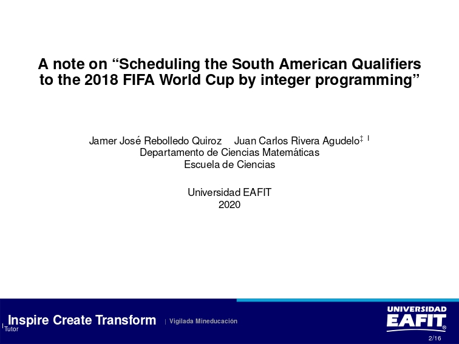
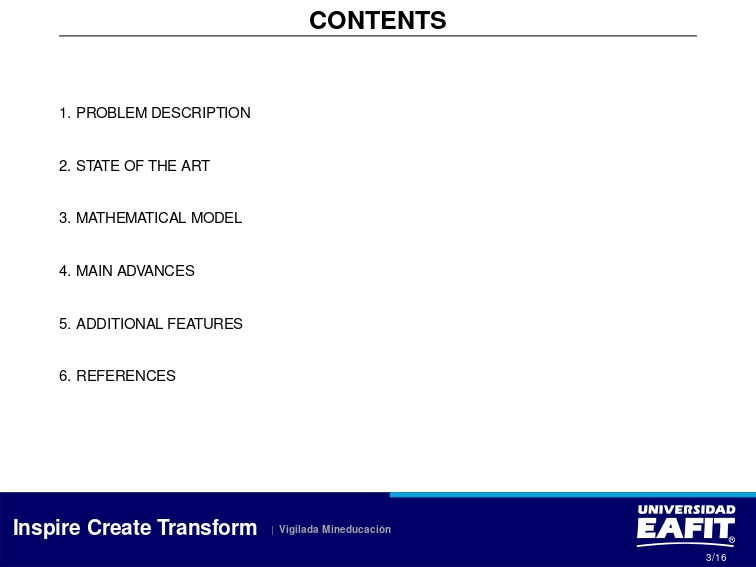

# Scheduling of Colombian professional soccer league (2019-2)

## Abstract

In this project, we propose a model for the scheduling of the Colombian professional soccer league. The model is based on constraint and integer programming. The model is implemented in Python using the PuLP library. The model is tested using data from the Colombian professional soccer league. The results show that the model is able to generate schedules that satisfy the constraints and that are similar to the schedules generated by the current scheduling system.

[Report](./reports/research_proposal.pdf)

